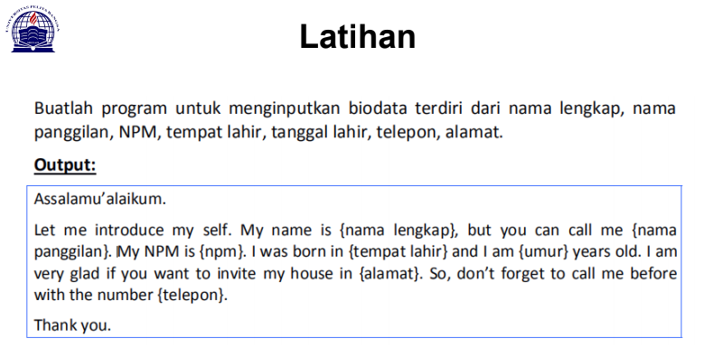
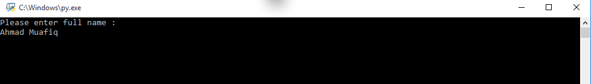

# PERTEMUAN KE 6 - Bahasa Pemrograman
**Repository ini dibuat untuk memenuhi tugas bahasa pemrograman pertemuan ke-4**

 **==================================================** <br>
**Nama      : Ahmad Muafiq**<br>
**NIM       : 312010152**<br>
**Kelas     : TI.20.B1**<br>
 **==================================================**

## PERTEMUAN 5 - TUGAS BAHASA PEMROGRAMAN

     
    Pada pertemuan ke-5 Bahasa pemrograman, saya diberi tugas oleh dosen untuk membuat aplikasi biodata dengan Python (seperti dibawah ini)

<br>

Saat ini saya akan menjelaskan hasil dari tugas tersebut <br>
Berikut *source code* nya atau klik link berikut ( [tugas-ke-5](p5_tugas.py) ): <br>

```python
print("Please enter full name : ")
fullname=input()

print("please insert your Nickname : ")
nickname=input()

print("please enter your NPM : ")
NPM=input()

print("please enter your Born place : ")
bornplace=input()

print("please insert your age : ")
age=input()

print("please enter your home address : ")
address=input()

print("please enter your phone number : ")
phonenumber=input()


print("\nAssalamualaikum Wr, Wb.")
print(f"\nLet me introduce my self. My name is {fullname}, but you can call me {nickname}. My NPM is {NPM}. I was Born in {bornplace} and i am {age} years old. I am very glad if you want to invite my house in {address}. So, don't forget to call me before with the number {phonenumber}.")
print("\nThank you.")
print("\n") 
``` 
<br>

Berikut penjelasanya : <br>
```python
print("Please enter full name : ")
```
Source Code ini berfungsi untuk mencetak hasil atau output berupa ***"Please enter full name"*** seperti gambar dibawah ini :
<br>


    